# Hallucination-Aware Multimodal Benchmark for Gastrointestinal Image Analysis with Large Vision Language Models #

📄**Paper Available: https://arxiv.org/pdf/2505.07001**  
🎉 **Accepted to MICCAI 2025 (Top 9% of submissions)**  


## 🧠 Key Contributions ##
* Multimodal image-text Gastrointestinal (GI) dataset, with VLM-generated descriptive responses, expert-labeled tags identifying hallucinated sentences, and their corresponding corrections.

* Extensive evaluation of state-of-the-art VLMs using both existing and proposed LLM-assisted evaluation metrics.

* Hallucination-aware fine-tuning shown to improve robustness compared to standard fine-tuning.


## 🗂 About Dataset ###
We used publicly available [Kvasir-v2](https://datasets.simula.no/kvasir/) images to generate medical reports using ChatGPT-4o, which were then reviewed by experts to identify and correct medical hallucinations. Our dataset not only provides the corrected responses of the vision-language model (VLM) but also includes sentence-level hallucination tags, offering additional insights into how the VLM hallucinates.
In summary it includes:
- VLM-generated medical reports  
- Expert annotations:
  - Sentence-level hallucination tags  
  - Corrected responses


### Images ###
 * Please refer to [Kvasir-v2](https://datasets.simula.no/kvasir/) dataset for the original images. Download **[kvasir-v2.zip](https://datasets.simula.no/kvasir/)**

 * The images can be visualized and annotated using this [Image Caption Annotation](https://github.com/bhattarailab/image-caption-annotation) tool.

 ### Text Annotations ###
  
The text annotations are available in the `dataset/Gut-VLM/` directory with the following structure:

* *`all_annotations.json`*: Complete dataset containing VLM-generated medical reports with expert annotations, including sentence-level hallucination tags and corrected responses.

* *`VQA_format_all_annotations.json`*: Question-Answer formatted version of the complete dataset, structured for VQA evaluation tasks.

* **Training/Testing Splits** (in `train_test_split/` directory):
  - *`train.json`*: Training set annotations
  - *`test.json`*: Testing set annotations
  - *`VQA_fromat_trainset_only.json`*: VQA-formatted training data
  - *`VQA_format_testset_only.json`*: VQA-formatted testing data
  - In `classwise_train_split/`: Class-wise train-split json files
  - In `classwise_test_split/`: Class-wise test-split json files

### Additional Resources ###

* **Training Style Data** (in `training_style/` directory):
  - *`hallucinated_aware_train.json`*: Hallucination-aware training example for fine-tuning VLMs

* **Example Results** (in `results_example/` directory):
  - *`final_qwen_caption_hal_aware_results.json`*: Sample test results from hallucination-aware model
  - *`groundtruth_test_captions.json`*: Ground-truth captions for the test set used for comparison

## 📏 About Evaluation Metrics ##

While several metrics such as BLEU, ROUGE, and METEOR are commonly used to evaluate the similarity between ground-truth texts and generated texts, they are often limited by context-length dependence, insensitivity to subtle semantic differences, and an inability to assess factual accuracy. We propose two LLM-assited metrics that use GPT4o's strong overall textual and semantic understanding to assess the similarity between ground-truth and generated outputs:

* **📝 Report Similarity (R-Sim):**  Rates coarse-level semantic similarity between the ground-truth and VLM responses on a scale of 1 to 5 (worst to best), using ChatGPT-4o
prompted to assess similarity with a focus on GI endoscopy and 12 diagnostic
questions.

* **❓ Question Answering Accuracy Score (QAAS):** Objectively
measures accuracy by comparing VLM responses to 12 ground-truth Q&A pairs,
with ChatGPT-4o handling synonyms and similar phrasing.


## 🔥 Hallucination-aware finetuning ##

Instead of instruction finetuning VLM models with the objective of generating ground-truth texts, we have used instruction finetuning to first detect hallucinated sentences in the default pretrained VLM response, followed by correcting the response. We used standard LORA for parameter efficient finetuning.


## 📊 Benchmarks ##

We evaluate our hallucination-aware fine-tuning strategy across various open-source VLMs and consistently demonstrate improved performance across multiple evaluation metrics.


## 📈 Evaluation Flow

The evaluation scripts are located in the `eval_scripts/` directory. The evaluation process consists of two evaluation methods:

### 📝 QA-Based Evaluation (QAAS)

```mermaid
flowchart TD
    classDef inputStyle fill:#E3F2FD,stroke:#1976D2,stroke-width:3px,color:#000,font-weight:bold,font-size:12px
    classDef scriptStyle fill:#FFF3E0,stroke:#F57C00,stroke-width:3px,color:#000,font-weight:bold,font-size:12px
    classDef outputStyle fill:#E8F5E8,stroke:#388E3C,stroke-width:3px,color:#000,font-weight:bold,font-size:12px

    A["📄 Input<br/>Descriptive Texts<br/>(Paragraph/Caption)"]
    B["🔧 caption2vqa.py<br/>Extract QA Pairs"]
    C["⚙️ parse_vqa.py<br/>Normalize Answers"]
    D["📊 evaluate_vqa.py<br/>Compute QAAS"]
    E["📈 QAAS Score<br/>(Accuracy)"]

    class A inputStyle
    class B,C,D scriptStyle
    class E outputStyle

    A -->|"VLM Generated<br/>Medical Reports"| B
    B -->|"Raw Q&A Pairs<br/>(12 questions)"| C
    C -->|"Normalized<br/>(Handle synonyms)"| D
    D -->|"Compare with<br/>Ground Truth"| E

    linkStyle 0 stroke:#1976D2,stroke-width:3px
    linkStyle 1 stroke:#F57C00,stroke-width:3px
    linkStyle 2 stroke:#F57C00,stroke-width:3px
    linkStyle 3 stroke:#388E3C,stroke-width:3px
```



### 📝 Report Similarity Evaluation (R-Sim)

```mermaid
flowchart TD
    classDef inputStyle fill:#E3F2FD,stroke:#1976D2,stroke-width:3px,color:#000,font-weight:bold,font-size:12px
    classDef scriptStyle fill:#FFF3E0,stroke:#F57C00,stroke-width:3px,color:#000,font-weight:bold,font-size:12px
    classDef outputStyle fill:#E8F5E8,stroke:#388E3C,stroke-width:3px,color:#000,font-weight:bold,font-size:12px

    A2["📄 Input<br/>Descriptive Texts<br/>(Paragraph/Caption)"]
    B2["🔧 evaluate_caption.py<br/>Semantic Comparison"]
    C2["📈 R-Sim Score<br/>(1-5 Scale)"]

    class A2 inputStyle
    class B2 scriptStyle
    class C2 outputStyle

    A2 -->|"VLM Generated<br/>Medical Reports"| B2
    B2 -->|"GPT-4o Analysis<br/>Semantic Similarity"| C2

    linkStyle 0 stroke:#1976D2,stroke-width:3px
    linkStyle 1 stroke:#388E3C,stroke-width:3px
```



### Citation:

#### Cite our work in your research as follows:

```bibtex
@article{khanal2025hallucination,
  title={Hallucination-Aware Multimodal Benchmark for Gastrointestinal Image Analysis with Large Vision-Language Models},
  author={Khanal, Bidur and Pokhrel, Sandesh and Bhandari, Sanjay and Rana, Ramesh and Shrestha, Nikesh and Gurung, Ram Bahadur and Linte, Cristian and Watson, Angus and Shrestha, Yash Raj and Bhattarai, Binod},
  journal={arXiv preprint arXiv:2505.07001},
  year={2025},
  Note = {Accepted at MICCAI 2025}
}

```

#### To cite Kvasir-v2:
```@inproceedings{Pogorelov:2017:KMI:3083187.3083212,
  title = {KVASIR: A Multi-Class Image Dataset for Computer Aided Gastrointestinal Disease Detection},
  author = {
     Pogorelov, Konstantin and Randel, Kristin Ranheim and Griwodz, Carsten and
     Eskeland, Sigrun Losada and de Lange, Thomas and Johansen, Dag and
     Spampinato, Concetto and Dang-Nguyen, Duc-Tien and Lux, Mathias and
     Schmidt, Peter Thelin and Riegler, Michael and Halvorsen, P{\aa}l
  },
  booktitle = {Proceedings of the 8th ACM on Multimedia Systems Conference},
  series = {MMSys'17},
  year = {2017},
  isbn = {978-1-4503-5002-0},
  location = {Taipei, Taiwan},
  pages = {164--169},
  numpages = {6},
  doi = {10.1145/3083187.3083212},
  acmid = {3083212},
  publisher = {ACM},
  address = {New York, NY, USA},
}